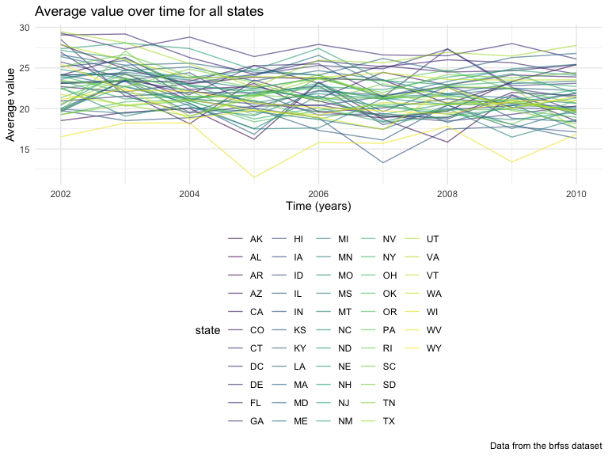

p8105\_hw3\_sg3891
================
Sandya Ganesh
2021-10-20

## Question 1

We will explore the instacart data set

#### Short description of instacart data set

``` r
data("instacart")
```

The code below provides the size and structure of the data, describes
some key variables, and gives illustrative examples of observations.

The total number of observations in the instacart data set is 1384617
observations with 15 variables. Some key variables in this data set
include order\_id, user\_id, product\_name. There are 131209 unique
orders in this data set, with 131209 users placing these orders, which
means that each user has placed 1 instacart order in this dataset. These
orders include products such as Bulgarian Yogurt, Organic 4% Milk Fat
Whole Milk Cottage Cheese, Organic Celery Hearts. This dataset includes
orders for 39123 unique products.

#### Question 1.1

There are 134 aisles, and the aisles that the most items are ordered
from are packaged vegetables fruits, fresh fruits, fresh vegetables.
This can also be seen in the below code chunk and output.

``` r
instacart %>%
  count(aisle) %>% 
  arrange(desc(n))
```

    ## # A tibble: 134 × 2
    ##    aisle                              n
    ##    <chr>                          <int>
    ##  1 fresh vegetables              150609
    ##  2 fresh fruits                  150473
    ##  3 packaged vegetables fruits     78493
    ##  4 yogurt                         55240
    ##  5 packaged cheese                41699
    ##  6 water seltzer sparkling water  36617
    ##  7 milk                           32644
    ##  8 chips pretzels                 31269
    ##  9 soy lactosefree                26240
    ## 10 bread                          23635
    ## # … with 124 more rows

#### Question 1.2

The code chunk below produces a plot that shows the number of items
ordered in each aisle, limiting this to aisles with more than 10000
items ordered.

``` r
instacart %>% 
  count(aisle) %>% 
  filter(n > 10000) %>% 
  mutate(
    aisle = factor(aisle),
    aisle = fct_reorder(aisle, n)
  ) %>%
  ggplot(aes(x = aisle, y = n)) + 
  geom_point() + 
  labs(
    title = "Instacart Popular Aisles ",
    x = "Aisle Names",
    y = "Number of items ordered",
    caption = "Data from the instacart dataset"
  ) +
  theme(axis.text.x = element_text(angle = 90, vjust = 0.5, hjust = 1))
```

<!-- -->

Looking at the plot of number of items ordered in each aisle above, we
can see that the majority of popular aisles have less than 20,000 items
ordered. However, there are 2 aisles that standout, including fresh
fruit, and fresh vegetables, which each have over 140,000 items ordered.

#### Question 1.3

Below is a table showing the three most popular items in each of the
aisles “baking ingredients”, “dog food care”, and “packaged vegetables
fruits”, with the number of times each item is ordered.

``` r
instacart %>% 
  filter(aisle %in% c("baking ingredients", "dog food care", "packaged vegetables fruits")) %>%
  group_by(aisle) %>% 
  count(product_name) %>% 
  rename(order_count = n) %>% 
  mutate(rank = min_rank(desc(order_count))) %>% 
  filter(rank < 4) %>% 
  arrange(aisle, rank) %>% 
  knitr::kable()
```

| aisle                      | product\_name                                 | order\_count | rank |
|:---------------------------|:----------------------------------------------|-------------:|-----:|
| baking ingredients         | Light Brown Sugar                             |          499 |    1 |
| baking ingredients         | Pure Baking Soda                              |          387 |    2 |
| baking ingredients         | Cane Sugar                                    |          336 |    3 |
| dog food care              | Snack Sticks Chicken & Rice Recipe Dog Treats |           30 |    1 |
| dog food care              | Organix Chicken & Brown Rice Recipe           |           28 |    2 |
| dog food care              | Small Dog Biscuits                            |           26 |    3 |
| packaged vegetables fruits | Organic Baby Spinach                          |         9784 |    1 |
| packaged vegetables fruits | Organic Raspberries                           |         5546 |    2 |
| packaged vegetables fruits | Organic Blueberries                           |         4966 |    3 |

From the table above, we can see that the most ordered products in the
baking ingredients aisle include light brown sugar, pure baking soda,
and cane sugar. There are much fewer orders within the dog food care
aisle (less than 1/10th of the orders in the baking ingredients aisle).
The most ordered packaged vegetables fruits include organic baby
spinach, organic raspberries, and organic blueberries.

#### Question 1.4

The code chunk below produces a table showing the mean hour of the day
at which Pink Lady Apples and Coffee Ice Cream was ordered on each day
of the week.

``` r
instacart %>% 
  filter(product_name %in% c("Pink Lady Apples", "Coffee Ice Cream")) %>% 
  group_by(product_name, order_dow) %>%
  summarize(average = round(mean(order_hour_of_day), 2)) %>%
  pivot_wider(
    names_from = order_dow,
    values_from = average
  ) %>%
   rename( "Sunday" = "0","Monday" = "1", "Tuesday" = "2", "Wednesday" = "3", "Thursday" = "4", "Friday" = "5", "Saturday" = "6") %>% 
  knitr::kable()
```

| product\_name    | Sunday | Monday | Tuesday | Wednesday | Thursday | Friday | Saturday |
|:-----------------|-------:|-------:|--------:|----------:|---------:|-------:|---------:|
| Coffee Ice Cream |  13.77 |  14.32 |   15.38 |     15.32 |    15.22 |  12.26 |    13.83 |
| Pink Lady Apples |  13.44 |  11.36 |   11.70 |     14.25 |    11.55 |  12.78 |    11.94 |

From the table above, we can see that coffee ice cream is purchased at
the latest time during the week on Tuesday, and pink lady apples are
ordered at the earliest time during the week on Tuesday, which is
interesting.

## Question 2

The following question uses the BRFSS data.

#### Load and clean the BRFSS data

The code chunk below loads and cleans the data:

``` r
data("brfss_smart2010")

brfss_cleaned = brfss_smart2010 %>% 
  janitor::clean_names() %>%
  filter(topic %in% c("Overall Health")) %>%
  mutate(response = factor(response, levels = c("Poor", "Fair", "Good", "Very good", "Excellent"))) %>%
  arrange(response) %>%
  filter(response %in% c("Excellent", "Very good", "Good", "Fair", "Poor")) %>%
  separate(locationdesc, into = c('state', 'location'), sep = ' - ')
```

#### Question 2.1

In 2002, which states were observed at 7 or more locations?

``` r
brfss_cleaned %>% 
  filter(year == "2002") %>% 
  group_by(state) %>% 
  distinct(location) %>% 
  count(state) %>% 
  filter(n >= 7) %>% 
  select(state)
```

    ## # A tibble: 6 × 1
    ## # Groups:   state [6]
    ##   state
    ##   <chr>
    ## 1 CT   
    ## 2 FL   
    ## 3 MA   
    ## 4 NC   
    ## 5 NJ   
    ## 6 PA

As seen above, the states observed at 7 or more locations in 2002
include Connecticut, Florida, Massachusetts, North Carolina, New Jersey,
and Pennsylvania.

In 2010, which states were observed at 7 or more locations?

``` r
brfss_cleaned %>% 
  filter(year == "2010") %>% 
  group_by(state) %>% 
  distinct(location) %>% 
  count(state) %>% 
  filter(n >= 7) %>% 
  select(state)
```

    ## # A tibble: 14 × 1
    ## # Groups:   state [14]
    ##    state
    ##    <chr>
    ##  1 CA   
    ##  2 CO   
    ##  3 FL   
    ##  4 MA   
    ##  5 MD   
    ##  6 NC   
    ##  7 NE   
    ##  8 NJ   
    ##  9 NY   
    ## 10 OH   
    ## 11 PA   
    ## 12 SC   
    ## 13 TX   
    ## 14 WA

As seen above, the states observed at 7 or more locations in 2010
include California, Colorado, Florida, Massachusetts, Maryland, North
Carolina, Nebraska, New Jersey, New York, Ohio, Pennsylvania, South
Carolina, Texas, and Washington.

Comparing the states observed at 7 or more locations in 2002 vs in 2010,
we can see that there are many more states in 7+ locations in 2010 (14
states in 2010 vs 6 states in 2002).

#### Question 2.2

The code below produces a dataset that is limited to Excellent
responses, and contains, year, state, and a variable that averages the
data\_value across locations within a state.

It additionally generates a “spaghetti” plot of this average value over
time within a state.

``` r
spaghetti_df = brfss_cleaned %>% 
  filter(response == "Excellent") %>% 
  group_by(state, year) %>% 
  summarize(average = round(mean(data_value, na.rm = TRUE), 2)) %>%
  select(year, state, average)
```

``` r
ggplot(spaghetti_df, aes(x = year, y = average, color = state)) + 
  geom_line() + 
  labs(
    title = "Average value over time for all states ",
    x = "Time (years)",
    y = "Average value",
    caption = "Data from the brfss dataset"
  )
```

<!-- -->
Looking at the spaghetti plot above, we see that over time from 2002 to
2010, there is a lot of flux in average value, with a trend of
decreasing average value in general across the states.

#### Question 2.3

Make a two-panel plot showing, for the years 2006, and 2010,
distribution of data\_value for responses (“Poor” to “Excellent”) among
locations in NY State.

``` r
two_2006_2010 = brfss_cleaned %>% 
  filter(year == "2006" | year == "2010") %>% 
  filter(state == "NY")

ggplot(two_2006_2010, aes(x = response, y = data_value, fill = response)) + 
  geom_boxplot() + 
  facet_grid(. ~ year) +
  labs(
    title = "Distribution of data_value for responses in NY",
    x = "Responses",
    y = "data_value",
    caption = "Data from the brfss dataset"
  )
```

<!-- -->

Comparing the box plots in 2006 and 2010 for New York, it appears that
the data values for Excellent and Very good responses are higher in 2010
than in 2006. There is also a lot more variability and a larger standard
deviation in the Fair category distribution data value in 2010 when
compared to 2006.

## Question 3

Load, tidy, and otherwise wrangle the data. The final data set includes
a weekday vs weekend variable as well.

#### Load and clean the accel data

``` r
accel_cleaned = 
  read_csv("./data/accel_data.csv") %>%
  janitor::clean_names() %>% 
  mutate(
    day_type = ifelse(day == "Saturday" | day == "Sunday", "Weekend", "Weekday"),
    day = factor(day, levels = c("Sunday", "Monday", "Tuesday", "Wednesday", "Thursday", "Friday", "Saturday"))
    ) %>%
  pivot_longer(
    cols = activity_1:activity_1440,
    names_to = "activity_number",
    values_to = "activity_counts",
    names_prefix = "activity.",
  )
```

#### Describe accel data set

Describe the resulting dataset (e.g. what variables exist, how many
observations, etc)

Looking into this data set, we can see that the total number of
observations in the accel data set is 50400 observations with 6
variables. The variables in this data set include order\_id,
product\_id, add\_to\_cart\_order, reordered, user\_id, eval\_set.

#### Question 3.1

Using your tidied dataset, aggregate across minutes to create a total
activity variable for each day, and create a table showing these totals.
Are any trends apparent?

``` r
accel_total_daily = accel_cleaned %>% 
  group_by(day_id) %>% 
  summarize(total_daily_activity = sum(activity_counts)) %>%
  select(day_id, total_daily_activity) %>% 
  knitr::kable()

accel_total_daily
```

| day\_id | total\_daily\_activity |
|--------:|-----------------------:|
|       1 |              480542.62 |
|       2 |               78828.07 |
|       3 |              376254.00 |
|       4 |              631105.00 |
|       5 |              355923.64 |
|       6 |              307094.24 |
|       7 |              340115.01 |
|       8 |              568839.00 |
|       9 |              295431.00 |
|      10 |              607175.00 |
|      11 |              422018.00 |
|      12 |              474048.00 |
|      13 |              423245.00 |
|      14 |              440962.00 |
|      15 |              467420.00 |
|      16 |              685910.00 |
|      17 |              382928.00 |
|      18 |              467052.00 |
|      19 |              371230.00 |
|      20 |              381507.00 |
|      21 |              468869.00 |
|      22 |              154049.00 |
|      23 |              409450.00 |
|      24 |                1440.00 |
|      25 |              260617.00 |
|      26 |              340291.00 |
|      27 |              319568.00 |
|      28 |              434460.00 |
|      29 |              620860.00 |
|      30 |              389080.00 |
|      31 |                1440.00 |
|      32 |              138421.00 |
|      33 |              549658.00 |
|      34 |              367824.00 |
|      35 |              445366.00 |

Looking at the above table, it appears that the subject had very little
activity on day 24 and 31. Other than that, activity appears to
fluctuate throughout the 35 days, with no clear trend.

#### Question 3.2

Make a single-panel plot that shows the 24-hour activity time courses
for each day and use color to indicate day of the week. Describe in
words any patterns or conclusions you can make based on this graph.

``` r
accel_cleaned %>% 
  mutate(activity_number = as.numeric(activity_number)) %>% 
  group_by(day, activity_number) %>% 
  summarize(avg_value = mean(activity_counts)) %>% 
  ggplot(aes(x = activity_number, y = avg_value, color = day)) +
  geom_smooth() +
  scale_x_continuous(
    breaks = (1:24)*60 + 1,
    labels = c(1:24),
    name = "Hours in each day"
  ) + 
  labs(
    title = "24-hour activity time courses for each day of the week",
    x = "Hours (activity number)",
    y = "Average activity counts",
    color = "Day of the Week"
  )
```

<!-- -->

Looking at this graph, we can see that Friday average activity counts
peak at around hour 21, where the hour range is from 0-23.
